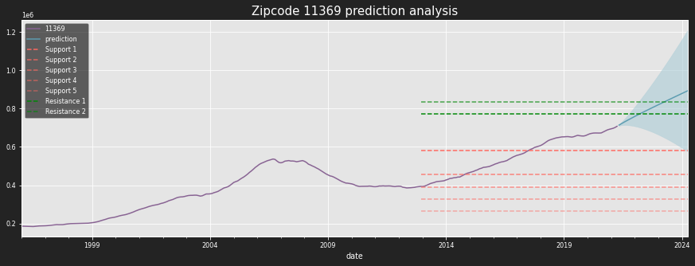
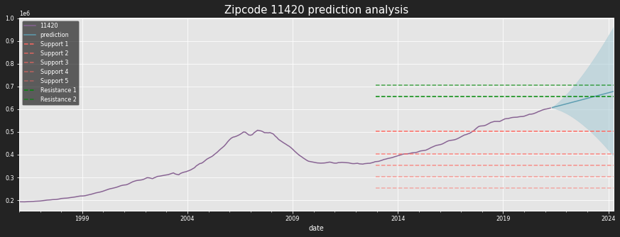
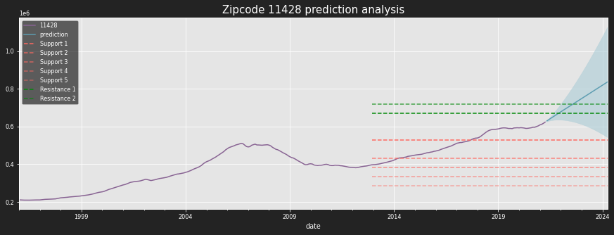

<h1>Deducing Investment Opportunity for a Real Estate Investment Company</h1>

By: [Tamjid Ahsan](https://www.linkedin.com/in/tamjidahsan/) 

<br>

As phase 4 project of [Flatiron Data Science Bootcamp](https://flatironschool.com/campus-and-online-data-science-bootcamp/).
* Student pace: Full Time
* Scheduled project review date/time: June 24, 2021, 05:00 PM [DST]
* Instructor name: James Irving
___


<h2>OVERVIEW</h2>

<br>
<p>New York City is among the most expensive and competitive housing markets in the USA. It was impacted severely by the COVID-19 with high job loss. NYC is among the top impacted areas of the country. New York has been recovering from the economic impacts of the pandemic as of mid 2021. The strong buyer demand has also changed the dynamics of the residential real estate sales market that had been cooling for nearly three years. </p>
<p>NYC, however, is still a buyer's real estate market and buyers may have an opportunity to get some heavy discounts. </p>
<p>Many industry experts have been predicting a strong property appreciation in New York starting from 2021. 2021 is should be a great year for property owners. Different business sectors have been opening up in different ways and at differing speeds with relaxing COVID-19 policies. The current trends show that the New York housing market will be hyperactive in the peak home-buying season. </p>


Home prices are still low compared to where they were last year, just before the pandemic hit New York City. Most buyers aren't paying sellers' asking prices.
In April 2021, the New York real estate market (statewide) showed strong sales due to pent-up buyer demand, according to the most recent housing report released by the [New York State Association of REALTORS®](https://www.nysar.com/). Closed and pending sales remained strong in April of 2021, marking the eighth consecutive month of sales growth in year-over-year comparisons. Since 2012, the NYC home values have appreciated by nearly 52% as per [Zillow Home Value Index](https://www.zillow.com/research/zhvi-methodology-2019-highlights-26221/).

<p>This makes New York as one of the best real estate market for homes to get into as the house prices are relatively low, high buyer power and huge inventory of homes for sale to choose from and a projected uptrend in price leading to higher return on investment.

Ref: [Norada Real Estate](https://www.noradarealestate.com/blog/new-york-real-estate-market/), [NY Post](https://nypost.com/article/nyc-real-estate-market-housing-prices/).

</p>

___


<h2>BUSINESS PROBLEM</h2>

<br>

<p><strong><em>XYZ, Inc. LLC</strong></em> is a (read: fictional) private equity investment company based on Queens, New York. They want to invest in the housing market for relatively short term, three years. They want to isolate and invest in properties with the highest return on investment potential based on geographical location close to their operation base in Queens, as they want to cluster their investment based on location. For this analysis, all 55 zipcodes of Queens county of New York city, NY were considered.</p>

<br>

<p>This analysis will recommend <strong>top five</strong> zipcodes with with return on investment potential with some insights, which will aid the top management of the company to make an educated decision on where to invest.</p><br>


<br>

Source: image generated by author using plotly, and online gif maker.

___

<h2>Methodology</h2>

<br>

- Zillow House Value dataset is used. (more info on OBTAIN section)
- Data Science Process of the O.S.E.M.N. framework is adapted for this analysis
- Several analysis techniques were used such as conventional time series method such as `ARIMA` and `SARIMAX` by `statsmodels` on all zipcodes.
 - not including `white nosie` or `random walk model`s.
- forecasting procedure implemented by Facebook, Inc. named `Prophet` for a handful of zipcodes, can be found in APPENDIX.

- Implementation of recurrent neural network (RNN - LTMS and GRU) and transfer learning (combining `SARIMAX` and `RNN`) is a work in progress.

___

<h2>IMPORTS</h2>

<br>

- custom functions are used, can be found in `./imports_and_functions/functions.py`
- most of the imports and notebook formatting used in this analysis is in `./imports_and_functions/packages.py`
- those are also available in the APPENDIX section.


# OBTAIN

- Main dataset: 
  - Zillow Home Value Index (ZHVI): A smoothed, seasonally adjusted measure of the typical home value and market changes across a given region and housing type. It reflects the typical value for homes in the 35th to 65th percentile range. This data is used for the Time Series analysis obtained form [Zillow Research](https://www.zillow.com/research/data/). This data is separated by zipcode. A copy of that file renamed as `zillow_raw_2021.csv` can be found [here](https://github.com/tamjid-ahsan/dsc-phase-4-project/blob/38580a57208e29a48892293800a5dd12983dbfba/data/zillow_raw_2021.csv). Explanation of methodology can be found [here](https://www.zillow.com/research/zhvi-methodology-2019-deep-26226/).
- GeoJson:
  - GeoJson file used to generate map is sourced from [here](https://github.com/OpenDataDE/State-zip-code-GeoJSON/blob/4cc2657044efd08477465aed1912dca30198d441/ny_new_york_zip_codes_geo.min.json) provided by [Open Data Delaware](https://github.com/OpenDataDE/). A copy of that can be found at `./data/ny_new_york_zip_codes_geo.min.json` in this repository.
- Zipcodes with Neighborhood information
  - This file was obtained from [here](https://github.com/erikgregorywebb/nyc-housing/blob/master/Data/nyc-zip-codes.csv). A copy of this can be found at `./data/nyc-zip-codes.txt` in this repository.

## Zillow Dataset information<br>


| Column Name | Expaination | Range |
|-|-|-|
| RegionID | Unique Region Identifyer | from 58001 to 753844 |
| SizeRank | Ranked by Population | from 0 to 35187 |
| RegionName | Zipcode | 30842 unique values |
| RegionType | Type of location | constant value of "Zip" |
| StateName | Name of State | 51  unique values |
| State | Name of State | 51  unique values |
| City | City name | 15005 unique values |
| Metro | Metromoliton area | 862 unique values |
| CountyName | Name of county | 1758 unique values |
|  |  |  |
| Rest of the colums | dates | from Jan 31, 1996 to Apr 30, 2021 |


# SCRUB & EXPLORE

Focusing only on 55 zip codes in Queens County, New York.


## EDA

### Average home price by zipcode
    

    
Typical house price in Queens ranges from 77k to just over 960k. Mean price is `$375207`. Mean 25th quantile is  `$285044` and `$457253` is 75th quantile. Zip code `11363` has the highest value and `11692` has the lowest property value.

### Recent trend
 

    
House price increased till 2008 and then fell because of the global financial crisis, caused by subprime mortgage crisis that lead to a global recession. It did not recover till 2015-16. Although the recovery process stated from 2010. Recently the market is booming once again reaching new high.

### Three year ROI
    

    
ROI is negative for only a few of the zip codes
 - 11101
 - 11436
 - 11366<br>
 
Highest ROI Zip code:
 - 11104
 - 11692
 - 11693<br>
  
This makes Queens County NY a relatively safe investment region for real estate for housing market.

### Map of zipcodes


This is a visual representation of the zip codes based on the mean typical house value of Queens County NY. The bubbles are mostly the same size, meaning that they share some similar properties across the zip codes.
# MODEL

## Model on test Zipcode

### grid searching using  pmdarima

BEST MODEL<br>

<br>

Grid searching using pyramidarima for best p, d, q, P, D, Q, m for using in a SARIMA model using predefined conditions and shows model performance for predicting in the future.<br>

<br>

Predefined parameters:<br>
 - d and D is calculated using ndiffs using 'adf'(Augmented Dickey–Fuller test for Unit Roots) for d and 'ocsb' (Osborn, Chui, Smith, and Birchenhall Test for Seasonal Unit Roots) for D.
 - parameters for auto_arima model:
 - start_p = 0; The starting value of p, the order (or number of time lags) of the auto-regressive (“AR”) model.
 - d = d; The order of first-differencing,
 - start_q = 0; order of the moving-average (“MA”) model,
 - max_p = 3, max value for p
 - max_q = 3, max value for q
 - start_P = 0; the order of the auto-regressive portion of the seasonal model,
 - D = D; The order of the seasonal differencing,
 - start_Q = 0; the order of the moving-average portion of the seasonal model,
 - max_P = 3, max value of P
 - max_Q = 3, max value for Q
 - m = 12; The period for seasonal differencing, refers to the number of periods in each season.,
 - seasonal = True; this data is seasonal,
 - stationary = False; data is not stationary,
 - information_criterion = 'oob', optimizing on `out-of-bag` sample validation on a scoring metric, other information criterias did not perform well
 - out_of_sample_size = 12, step hold out for validation,
 - scoring = 'mse', validation metric,
 - method = 'lbfgs'; limited-memory Broyden-Fletcher-Goldfarb-Shanno with optional box constraints, BFGS is  in the family of quasi-Newton-Raphson methods that approximates the `bfgs` using a limited amount of computer memory.

all other parameters were left at default.

SAMPLE OF THE PROCESS
    
    Best model:  ARIMA(1,2,2)(2,0,0)[12] intercept
    Total fit time: 54.273 seconds
    
    ===========================
    Model Diagonostics of 11417
    ===========================

<table class="simpletable">
<caption>SARIMAX Results</caption>
<tr>
  <th>Dep. Variable:</th>                  <td>y</td>                <th>  No. Observations:  </th>    <td>243</td>   
</tr>
<tr>
  <th>Model:</th>           <td>SARIMAX(1, 2, 2)x(2, 0, [], 12)</td> <th>  Log Likelihood     </th> <td>-2108.641</td>
</tr>
<tr>
  <th>Date:</th>                   <td>Fri, 18 Jun 2021</td>         <th>  AIC                </th> <td>4231.282</td> 
</tr>
<tr>
  <th>Time:</th>                       <td>13:51:27</td>             <th>  BIC                </th> <td>4255.676</td> 
</tr>
<tr>
  <th>Sample:</th>                         <td>0</td>                <th>  HQIC               </th> <td>4241.110</td> 
</tr>
<tr>
  <th></th>                             <td> - 243</td>              <th>                     </th>     <td> </td>    
</tr>
<tr>
  <th>Covariance Type:</th>               <td>opg</td>               <th>                     </th>     <td> </td>    
</tr>
</table>
<table class="simpletable">
<tr>
      <td></td>         <th>coef</th>     <th>std err</th>      <th>z</th>      <th>P>|z|</th>  <th>[0.025</th>    <th>0.975]</th>  
</tr>
<tr>
  <th>intercept</th> <td>   13.6332</td> <td>   41.466</td> <td>    0.329</td> <td> 0.742</td> <td>  -67.639</td> <td>   94.905</td>
</tr>
<tr>
  <th>ar.L1</th>     <td>    0.7545</td> <td>    0.377</td> <td>    2.000</td> <td> 0.045</td> <td>    0.015</td> <td>    1.494</td>
</tr>
<tr>
  <th>ma.L1</th>     <td>   -0.7661</td> <td>    0.384</td> <td>   -1.995</td> <td> 0.046</td> <td>   -1.519</td> <td>   -0.013</td>
</tr>
<tr>
  <th>ma.L2</th>     <td>   -0.0172</td> <td>    0.015</td> <td>   -1.144</td> <td> 0.253</td> <td>   -0.047</td> <td>    0.012</td>
</tr>
<tr>
  <th>ar.S.L12</th>  <td>   -0.0190</td> <td>    0.011</td> <td>   -1.683</td> <td> 0.092</td> <td>   -0.041</td> <td>    0.003</td>
</tr>
<tr>
  <th>ar.S.L24</th>  <td>    0.0097</td> <td>    0.058</td> <td>    0.166</td> <td> 0.868</td> <td>   -0.104</td> <td>    0.124</td>
</tr>
<tr>
  <th>sigma2</th>    <td> 2.252e+06</td> <td> 1.23e+05</td> <td>   18.370</td> <td> 0.000</td> <td> 2.01e+06</td> <td> 2.49e+06</td>
</tr>
</table>
<table class="simpletable">
<tr>
  <th>Ljung-Box (L1) (Q):</th>     <td>14.92</td> <th>  Jarque-Bera (JB):  </th> <td>355.62</td>
</tr>
<tr>
  <th>Prob(Q):</th>                <td>0.00</td>  <th>  Prob(JB):          </th>  <td>0.00</td> 
</tr>
<tr>
  <th>Heteroskedasticity (H):</th> <td>1.54</td>  <th>  Skew:              </th>  <td>-0.59</td>
</tr>
<tr>
  <th>Prob(H) (two-sided):</th>    <td>0.05</td>  <th>  Kurtosis:          </th>  <td>8.83</td> 
</tr>
</table><br/><br/>Warnings:<br/>[1] Covariance matrix calculated using the outer product of gradients (complex-step).


    

    

    =================================
    Performance on test data of 11417
    =================================
    Root Mean Squared Error of test and prediction: 35232.19339655126
    Mean Squared Error: 1241307451.5319903
    Mean Absolute Error: 31029.564416600693
    


    

    


    

    


    =================================
    Forecast of 11417
    =================================
    


    

    


    

    

<table border="1" class="dataframe">
  <thead>
    <tr style="text-align: right;">
      <th></th>
      <th>zipcode</th>
      <th>mean_forecasted_roi</th>
      <th>lower_forecasted_roi</th>
      <th>upper_forecasted_roi</th>
      <th>std_forecasted_roi</th>
    </tr>
  </thead>
  <tbody>
    <tr>
      <th>0</th>
      <td>11417</td>
      <td>18.57</td>
      <td>-29.81</td>
      <td>66.95</td>
      <td>48.38</td>
    </tr>
  </tbody>
</table>
</div>


Model looks good in fitting and predicting with some long tailed residuals at both end. It can capture the future but with less certainty. This is expected as determinant house price is a combination of other factors which were not considered, e.g., loan interest rate, recent development and other external factors.

I am going to consider these parameters as the best one for this type of model. This can be improved by using SARIMAX model by using some of those factors as exog, but this increased model complexity and data needed for model as the exog's true data or a proxy is needed for prediction in the future.

## All Zipcodes
 
 This process is run on a loop for all the zipcodes and results saved and used for the next part of the analysis.

## High return Zipcodes

Criteria for selecting best zipcode:

Return on investment after three years<br>

<br>

<p>Cost is assumed to be the last true value of the median price of the zipcode, i.e., value on April 30, 2021. And revenue is assumed to the mean forecasted value after three years, i.e., 36 steps in the future. Then standard deviation is taken of the return on investment on upper confidence level and lower confidence level respectively as a proxy of risk of investment.</p><br>

Top five zipcodes based on best 15 (27 percent of all available zipcode) ROI and then selecting top 5 of the based on lowest risk, i.e., the risk proxy mentioned above. 


<div>
<table border="1" class="dataframe">
  <thead>
    <tr style="text-align: right;">
      <th></th>
      <th>mean_forecasted_roi</th>
      <th>std_forecasted_roi</th>
    </tr>
    <tr>
      <th>zipcode</th>
      <th></th>
      <th></th>
    </tr>
  </thead>
  <tbody>
    <tr>
      <th>11429</th>
      <td>22.230379</td>
      <td>45.001385</td>
    </tr>
    <tr>
      <th>11428</th>
      <td>34.241021</td>
      <td>47.287097</td>
    </tr>
    <tr>
      <th>11427</th>
      <td>30.558596</td>
      <td>47.554807</td>
    </tr>
    <tr>
      <th>11423</th>
      <td>39.547861</td>
      <td>48.105119</td>
    </tr>
    <tr>
      <th>11417</th>
      <td>18.564516</td>
      <td>48.358635</td>
    </tr>
  </tbody>
</table>
</div>


    

    


<div>

<table border="1" class="dataframe">
  <thead>
    <tr style="text-align: right;">
      <th></th>
      <th>aic</th>
      <th>bic</th>
      <th>oob</th>
      <th>rmse</th>
      <th>mse</th>
      <th>r2</th>
      <th>test_roi</th>
      <th>pred_roi</th>
      <th>three_year_projected_mean_roi</th>
      <th>risk</th>
      <th>three_year_projected_lower_roi</th>
      <th>three_year_projected_upper_roi</th>
    </tr>
    <tr>
      <th>ZipCode</th>
      <th></th>
      <th></th>
      <th></th>
      <th></th>
      <th></th>
      <th></th>
      <th></th>
      <th></th>
      <th></th>
      <th></th>
      <th></th>
      <th></th>
    </tr>
  </thead>
  <tbody>
    <tr>
      <th>11429</th>
      <td>4188.75</td>
      <td>4216.63</td>
      <td>74980018.35</td>
      <td>11209.0</td>
      <td>10023.0</td>
      <td>0.894</td>
      <td>15.43</td>
      <td>21.44</td>
      <td>22.23</td>
      <td>70.71</td>
      <td>-22.77</td>
      <td>67.23</td>
    </tr>
    <tr>
      <th>11428</th>
      <td>4232.73</td>
      <td>4260.60</td>
      <td>33049249.59</td>
      <td>21826.0</td>
      <td>17787.0</td>
      <td>0.717</td>
      <td>12.16</td>
      <td>32.88</td>
      <td>34.24</td>
      <td>70.56</td>
      <td>-13.05</td>
      <td>81.53</td>
    </tr>
    <tr>
      <th>11427</th>
      <td>4193.11</td>
      <td>4227.96</td>
      <td>29656141.33</td>
      <td>32203.0</td>
      <td>29725.0</td>
      <td>0.423</td>
      <td>15.30</td>
      <td>29.42</td>
      <td>30.56</td>
      <td>71.48</td>
      <td>-17.00</td>
      <td>78.11</td>
    </tr>
    <tr>
      <th>11423</th>
      <td>4247.35</td>
      <td>4271.74</td>
      <td>17613244.80</td>
      <td>31539.0</td>
      <td>28175.0</td>
      <td>0.525</td>
      <td>16.57</td>
      <td>37.91</td>
      <td>39.55</td>
      <td>70.86</td>
      <td>-8.56</td>
      <td>87.65</td>
    </tr>
    <tr>
      <th>11417</th>
      <td>4231.28</td>
      <td>4255.68</td>
      <td>19098261.43</td>
      <td>35227.0</td>
      <td>31025.0</td>
      <td>0.386</td>
      <td>12.41</td>
      <td>17.90</td>
      <td>18.56</td>
      <td>69.87</td>
      <td>-29.79</td>
      <td>66.92</td>
    </tr>
  </tbody>
</table>
</div>


### Visual


# INTERPRET


<div>
<table border="1" class="dataframe">
  <thead>
    <tr style="text-align: right;">
      <th></th>
      <th>aic</th>
      <th>bic</th>
      <th>oob</th>
      <th>rmse</th>
      <th>mse</th>
      <th>r2</th>
      <th>test_roi</th>
      <th>pred_roi</th>
      <th>three_year_projected_mean_roi</th>
      <th>risk</th>
      <th>three_year_projected_lower_roi</th>
      <th>three_year_projected_upper_roi</th>
    </tr>
    <tr>
      <th>ZipCode</th>
      <th></th>
      <th></th>
      <th></th>
      <th></th>
      <th></th>
      <th></th>
      <th></th>
      <th></th>
      <th></th>
      <th></th>
      <th></th>
      <th></th>
    </tr>
  </thead>
  <tbody>
    <tr>
      <th>11429</th>
      <td>4188.75</td>
      <td>4216.63</td>
      <td>74980018.35</td>
      <td>11209.0</td>
      <td>10023.0</td>
      <td>0.894</td>
      <td>15.43</td>
      <td>21.44</td>
      <td>22.23</td>
      <td>70.71</td>
      <td>-22.77</td>
      <td>67.23</td>
    </tr>
    <tr>
      <th>11428</th>
      <td>4232.73</td>
      <td>4260.60</td>
      <td>33049249.59</td>
      <td>21826.0</td>
      <td>17787.0</td>
      <td>0.717</td>
      <td>12.16</td>
      <td>32.88</td>
      <td>34.24</td>
      <td>70.56</td>
      <td>-13.05</td>
      <td>81.53</td>
    </tr>
    <tr>
      <th>11427</th>
      <td>4193.11</td>
      <td>4227.96</td>
      <td>29656141.33</td>
      <td>32203.0</td>
      <td>29725.0</td>
      <td>0.423</td>
      <td>15.30</td>
      <td>29.42</td>
      <td>30.56</td>
      <td>71.48</td>
      <td>-17.00</td>
      <td>78.11</td>
    </tr>
    <tr>
      <th>11423</th>
      <td>4247.35</td>
      <td>4271.74</td>
      <td>17613244.80</td>
      <td>31539.0</td>
      <td>28175.0</td>
      <td>0.525</td>
      <td>16.57</td>
      <td>37.91</td>
      <td>39.55</td>
      <td>70.86</td>
      <td>-8.56</td>
      <td>87.65</td>
    </tr>
    <tr>
      <th>11417</th>
      <td>4231.28</td>
      <td>4255.68</td>
      <td>19098261.43</td>
      <td>35227.0</td>
      <td>31025.0</td>
      <td>0.386</td>
      <td>12.41</td>
      <td>17.90</td>
      <td>18.56</td>
      <td>69.87</td>
      <td>-29.79</td>
      <td>66.92</td>
    </tr>
  </tbody>
</table>
</div>


<br>

Best investment opportunities
    

    

    

    

        

    
All of them looks similar. They all should be a good investment and they are not expected to go under support level one, they are likely to breach resistance two soon if the current trend persists.

Run `fig_dash.py` for an interactive dashboard from the location `./model/fog_dash.py` containing forecast for all the zip codes.
# RECOMMENDATION

Invest in following zip codes:
 - 11429
 - 11428
 - 11427
 - 11423
 - 11417<br>
 
Stay away from these, they are in a bubble :
- 11693
- 11415

Rule of thumb
 - Go southeast part of Queens for good investment opportunity.
 - Some of the house are overvalued, and awaits correction, be careful of those houses.


# CONCLUSION

Although modeling process is adequate, there are some caveats.
- This analysis does not consider Time Value of Money, one of major driver for any financial decision making process.
- Model generalization can be a issue. Analysis of individual models were not performed. All of the model were run on on a loop and then searched for possible issue based of different metrics, e.g., RMSE, true versus prediction accuracy.
- In general time series models are heavily contingent on model train test split, and recent trend. All of models were split on by 80-20 train-test ratio. There might be so issue of such generalization present in some of the model. Two of them were identified and dealt with, but without significant change in decision criteria. There might be some unidentified ones.

# NEXT STEPS

- Add variables to model, for using using a `SARIMAX` model
  - Interest rate
  - Economical indicators
  - Other qualitative indicators, e.g., school, public transport access.

- Try other models
    - RNN
    - Prophet
    - Use transfer learning
 
 # REPOSITORY STRUCTURE
 
```
├── README.md                                             # readme file
├── assets                                                # image files and backups
│   ├── ... 
├── data                                                  # data used for analysis
│   ├── lat_long.csv                                      # location info
│   ├── ny_new_york_zip_codes_geo.min.json                # GeoJSON file
│   ├── nyc-zip-codes.txt                                 # zipcodes with neighbourhood information
│   └── zillow_raw_2021.csv                               # primary data source
├── imports_and_functions                                 # local package
│   ├── __init__.py
│   ├── functions.py                                      # custom functions
│   └── packages.py                                       # imports used in the notebook
├── model                                                 # saved models and python obects
│   ├── fig_dash.py                                       # Dash dashboard
│   ├── ts.joblib                                         # cleaned and process time series
│   ├── model.joblib   ## NOT IN REPO
│   ├── model_compressed.joblib   ## NOT IN REPO
│   └── viz.joblib
├── presentation.pdf                                      # presentation file
├── presentation.pptx                                     # presentation file
├── student.ipynb                                         # Main notebook used
└── student.pdf                                           # pdf version of the notebook
```
 Note: scraping notebook is not synced to github for privacy reason. model files exceed github filesize limit, even github LFS.
 
For additional info contact [me](https://www.linkedin.com/in/tamjidahsan/)  via linkdin.